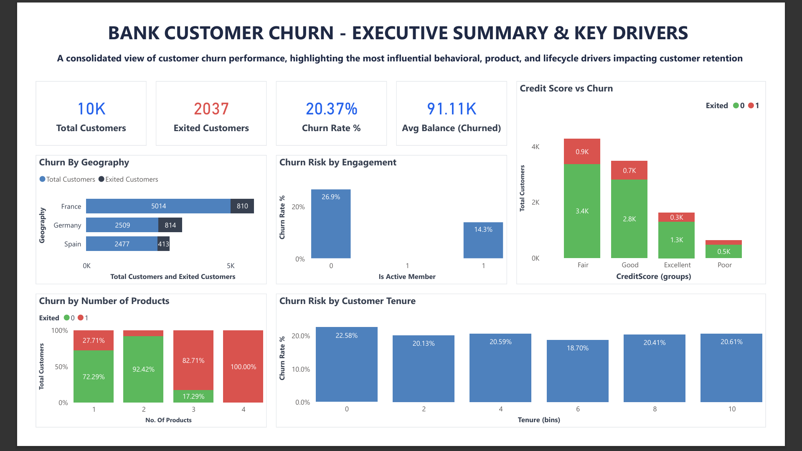
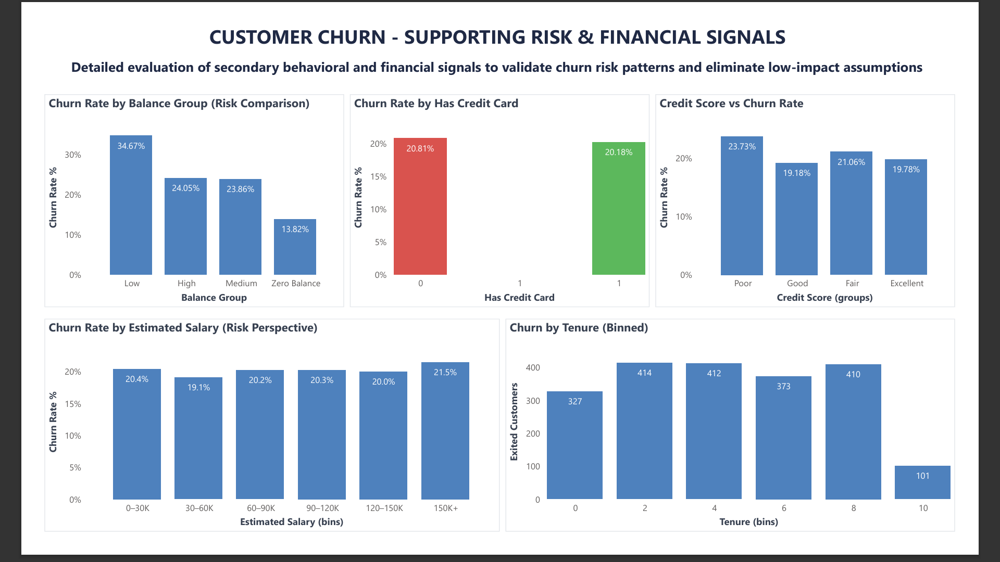
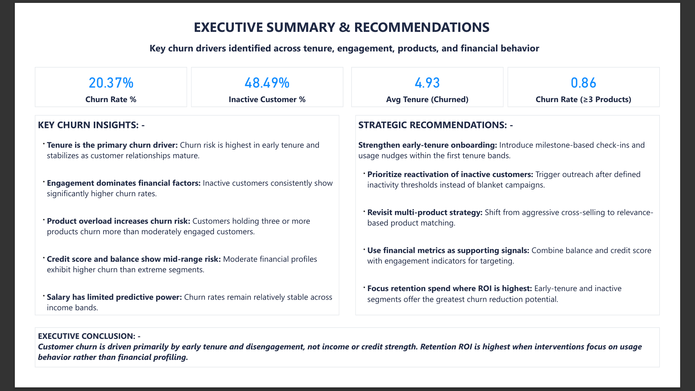

# 🏦 Bank Customer Churn Analysis (Power BI)

## 📌 Project Overview
Customer churn directly impacts revenue, customer lifetime value, and long-term business sustainability for retail banks.  
This project analyzes **10,000 bank customers** to identify **why customers churn**, **which factors truly matter**, and **where retention efforts should be focused for maximum ROI**.

Rather than treating all variables equally, the analysis deliberately distinguishes between:
- **Primary churn drivers** (actionable)
- **Supporting signals** (contextual)
- **Low-impact assumptions** (noise)

The result is a **decision-focused churn analysis**, not just a visualization exercise.

---

## 🎯 Business Objective
- Identify the **most influential drivers of customer churn**
- Validate or eliminate commonly assumed churn risk factors
- Translate analytical findings into **clear business actions**
- Support executive-level decision making with data

---

## 📊 Dataset Overview
- **Total Customers:** 10,000  
- **Churned Customers:** 2,037  
- **Overall Churn Rate:** 20.37%

### Features Used
- Geography  
- Credit Score  
- Age  
- Balance  
- Estimated Salary  
- Tenure  
- Number of Products  
- Is Active Member  
- Has Credit Card  
- Churn Indicator (Exited)

---

## 🛠 Tools & Skills Applied
- **Power BI Desktop**
- **DAX** (custom KPIs & churn measures)
- **Exploratory Data Analysis (EDA)**
- **Customer segmentation**
- **Business storytelling & executive reporting**

---

## 📷 Dashboard Walkthrough & Insights

### 1️⃣ Executive Summary & Key Drivers


**Purpose:**  
Provide a consolidated view of churn performance and surface the most impactful churn drivers.

**Key Insights**
- Overall churn rate is **20.37%**
- **Inactive customers churn nearly twice as much** as active customers
- Customers holding **three or more products exhibit disproportionately high churn**
- **Early-tenure customers** face the highest churn risk
- Engagement explains churn more effectively than geography

---

### 2️⃣ Supporting Risk & Financial Signals


**Purpose:**  
Validate churn hypotheses and eliminate weak or misleading predictors.

**Key Findings**
- **Estimated salary shows minimal churn variation**
- **Credit card ownership has negligible impact**
- **Moderate credit scores and balances show higher churn** than extreme segments
- Financial variables alone are **poor primary churn predictors**

This page acts as a **validation layer**, ensuring decisions are evidence-driven rather than assumption-driven.

---

### 3️⃣ Executive Summary & Strategic Recommendations


**Key Metrics**
- Inactive Customers: **48.49%**
- Avg Tenure (Churned Customers): **4.93**
- Churn Rate (≥3 Products): **0.86**

#### 🔑 Key Churn Insights
- **Tenure is the strongest churn driver:** Risk peaks early in the customer lifecycle
- **Engagement dominates financial factors:** Inactivity is the clearest churn signal
- **Product overload increases churn risk:** Aggressive cross-selling backfires
- **Income and credit strength have limited predictive power**

---

## 🎯 Strategic Recommendations
- **Strengthen early-tenure onboarding**  
  Introduce milestone-based engagement and proactive check-ins during the early lifecycle.
- **Prioritize reactivation of inactive customers**  
  Trigger targeted outreach once inactivity thresholds are crossed.
- **Revisit multi-product strategy**  
  Shift from aggressive cross-selling to relevance-based product matching.
- **Use financial metrics as supporting signals**  
  Combine them with engagement and tenure indicators rather than using them in isolation.
- **Focus retention spend where ROI is highest**  
  Early-tenure and inactive segments offer the greatest churn reduction potential.

---

## 🧠 Executive Conclusion
Customer churn is driven primarily by **early tenure and disengagement**, not by income or credit strength.  
Retention ROI is highest when interventions focus on **usage behavior and customer engagement**, rather than financial profiling.

---

## 📂 Repository Structure
```
Bank-Churn-Analysis/
│
├── data/
│ └── Churn_Modelling.csv
│ # Raw customer-level dataset used for analysis
│
├── dashboard/
│ └── EDA - Bank Churn Analysis.pbix
│ # Power BI dashboard containing data model, DAX measures, and visuals
│
├── screenshots/
│ ├── 01_executive_summary_key_drivers.png
│ │ # High-level churn KPIs and primary drivers
│ ├── 02_supporting_risk_financial_signals.png
│ │ # Validation of secondary and low-impact churn signals
│ └── 03_executive_summary_recommendations.png
│   # Consolidated insights and strategic recommendations
│
└── README.md

# Project documentation and business context
```
---

## 🚀 How to Use
1. Review the dashboard screenshots for a quick understanding of insights  
2. Open the `.pbix` file in **Power BI Desktop** for interactive exploration  
3. Use insights to design churn reduction and customer retention strategies  

---

## 📌 Why This Project Stands Out
This project demonstrates:
- Clear separation of **signal vs noise**
- Strong **business reasoning**, not just visualization
- Executive-level communication of insights
- Practical, ROI-focused recommendations

---

## ✅ Final Note
This project is designed to be **recruiter-readable**, **interview-ready**, and **business-relevant**.  
All insights are framed to support real-world decision making rather than exploratory analysis alone.


